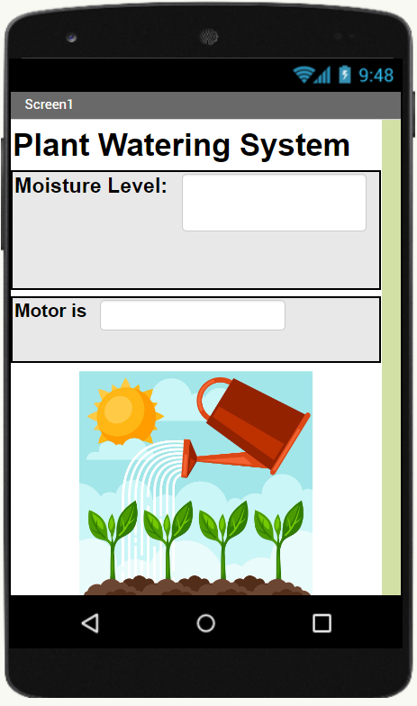

# Plant Health Monitoring System

This repository contains code and resources for an IoT-based Plant Health Monitoring System. The system gathers data using moisture sensors, light sensors, and other environmental sensors to monitor various parameters crucial for plant health, such as air quality, moisture levels, light intensity, dew, temperature, pressure, and pollution. The data is stored in Firebase.

## Overview

The project involves the following components:

- **IoT Sensors**: Moisture sensors, light sensors, and other environmental sensors collect real-time data.

- **Firebase**: Data collected from the sensors is stored in Firebase, providing a cloud-based storage solution.
- **Mobile App**: An Android app built with MiT App Inventor allows users to view and interact with the data collected from the sensors.

- **Machine Learning Model (LSTM)**: Utilizes the stored sensor data in CSV format to train an LSTM (Long Short-Term Memory) model for predicting plant health based on the collected environmental parameters.

## Project Structure

### Directories

- **/arduino_code**: Contains code for the IoT sensors, including scripts for data collection and transmission to Firebase.
- **/sagemaker**: Contains Jupyter Notebook or Python scripts used to create, train, and evaluate the LSTM model for plant health prediction.
- **/data**: Contains sample CSV files or a link to the Firebase database containing sensor data used for model training.

## Usage

### Setting Up IoT Sensors

1. Ensure proper connections of moisture sensors, light sensors, and other environmental sensors to the IoT device.
2. Upload the code located in `/arduino_code` to the IoT device.
3. Update Firebase credentials in the IoT code for data transmission.

### Machine Learning Model

1. Access the `/sagemaker` directory.
2. Use Jupyter Notebook or Python scripts to execute the machine learning model for training and prediction.
3. Ensure the CSV data or access to Firebase is available for model training.

## Requirements

- IoT device compatible with moisture sensors, light sensors, and other required environmental sensors.
- Firebase account for storing sensor data.
- MiT App Inventor for modifying the mobile app.
- Python environment with necessary libraries for running machine learning scripts.
